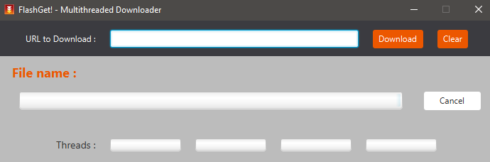
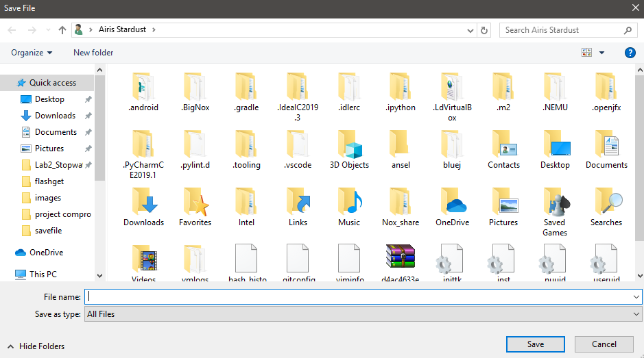

## PA4 - FlashGet 

FlashGet is the multi-threaded file downloader.It uses multiple threads to download parts of a file in parallel. 

Getting Started:
- You can open the program by double click on FlashGet.jar in lib folder.

This is how it looks like.

How to use it:
- You have to input a valid URL to the text field, and then click the "Download" button.
- After you click the download button the save dialog will show up like this,

all you need to do is type the file name, choose or type the file format, choose the directory and then click save.
- After that, program will download the file.
- You can cancel the download by click the "Cancel" button.
- "Clear" button use to clear the text in text field (your URL).
- If you input an invalid URL and click download, there will be an error message show up.

Author - Bheem Suttipong